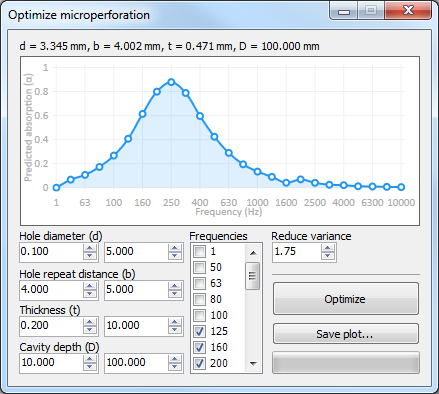

# Optimizing Acoustic Properties of Microperforated Panels
Student project for "Optimization Methods for Engineers" (227-0707-00 G). The goal was to optimize a real world problem using an optimization strategy from the lecture. I chose to optimize single layer microperforated panels using Differential Evolution.
## Screenshot

